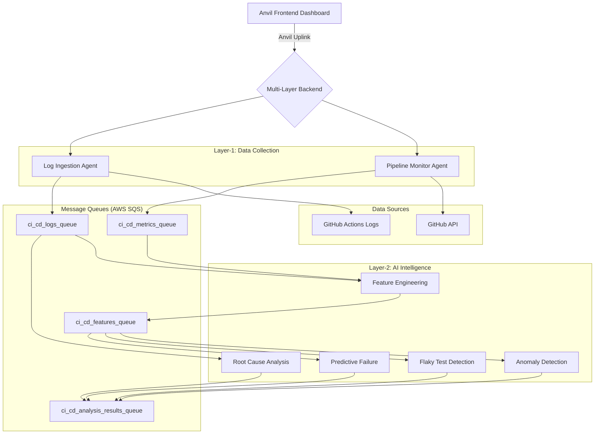

# AI-Driven CI/CD Pipeline Optimization & Self-Healing System

This repository contains a complete **Multi-Layer AI-Driven CI/CD Intelligence System** that combines data collection, machine learning analysis, and predictive insights to optimize and self-heal CI/CD pipelines.

## 🎯 System Overview

The system is built on a **2-layer architecture**:

### **Layer-1: Data Collection & Ingestion**
- **Pipeline Monitoring Agent**: Collects real-time workflow data from GitHub Actions
- **Log Ingestion Agent**: Fetches and processes job logs for analysis
- **Data Streaming**: Sends structured data to AWS SQS queues for processing

### **Layer-2: Intelligence & Analysis**
- **Feature Engineering Agent**: Transforms raw data into ML-ready features
- **Anomaly Detection Agent**: Identifies unusual pipeline performance patterns
- **Flaky Test Identification Agent**: Detects inconsistent test behavior
- **Root Cause Analysis Agent**: Analyzes failure logs and infers causes
- **Predictive Failure Agent**: Forecasts pipeline failures before they occur

### **Frontend Dashboard**
- **Multi-Layer Monitoring**: Real-time status of all 7 agents
- **Manual Triggers**: On-demand analysis and data collection
- **Configuration Management**: Dynamic repository and agent configuration

Communication between frontend and backend is handled via **Anvil Uplink** for seamless real-time interaction.

## 🏗️ System Architecture

The architecture is designed to be **decoupled, scalable, and intelligent**:

### **Data Flow Architecture**


### **Component Details**

#### **Layer-1 Agents (Data Collection)**
1. **Pipeline Monitoring Agent**:
   - Connects to GitHub API using Personal Access Token
   - Fetches workflow runs, jobs, steps, and commit data
   - Publishes structured metrics to `ci_cd_metrics_queue`

2. **Log Ingestion Agent**:
   - Fetches raw job logs from GitHub Actions
   - Processes and streams logs to `ci_cd_logs_queue`

#### **Layer-2 Agents (AI Intelligence)**
3. **Feature Engineering Agent**:
   - Consumes raw metrics and logs from Layer-1 queues
   - Generates ML-ready features (temporal, categorical, performance)
   - Publishes processed features to `ci_cd_features_queue`

4. **Anomaly Detection Agent**:
   - Uses Isolation Forest and One-Class SVM models
   - Detects performance anomalies and unusual patterns
   - Publishes anomaly alerts to `ci_cd_analysis_results_queue`

5. **Flaky Test Identification Agent**:
   - Analyzes test result patterns and calculates flakiness scores
   - Identifies intermittently failing tests
   - Publishes flaky test reports to analysis results queue

6. **Root Cause Analysis Agent**:
   - Performs NLP analysis on failure logs
   - Classifies error types and infers root causes
   - Publishes RCA insights to analysis results queue

7. **Predictive Failure Agent**:
   - Uses Random Forest and Logistic Regression models
   - Predicts pipeline failure probability
   - Publishes risk assessments to analysis results queue

#### **Frontend Dashboard**
- **Multi-layer status monitoring** for all 7 agents
- **Manual trigger controls** for immediate analysis
- **Real-time configuration** and repository management
- **Comprehensive logging** and error reporting

## ✨ Key Features

### **Multi-Layer Intelligence**
- **7 Specialized AI Agents** working in concert for comprehensive pipeline analysis
- **Real-time Data Processing** from GitHub Actions to actionable insights
- **Machine Learning Models** for anomaly detection and failure prediction
- **Natural Language Processing** for log analysis and root cause identification

### **Advanced Analytics**
- **Anomaly Detection**: Identifies unusual pipeline performance patterns using ML
- **Flaky Test Identification**: Detects and scores test reliability issues
- **Root Cause Analysis**: Automatically analyzes failure logs and suggests fixes
- **Predictive Failure Forecasting**: Predicts pipeline failures before they occur
- **Feature Engineering**: Transforms raw data into 20+ ML-ready features

### **User Experience**
- **Multi-Layer Dashboard**: Real-time monitoring of all 7 agents
- **Manual Trigger Controls**: On-demand analysis and data collection
- **Dynamic Configuration**: Configure GitHub repositories without restarts
- **Comprehensive Logging**: Detailed output and error reporting
- **Status Monitoring**: Real-time agent health and performance metrics

### **Technical Excellence**
- **Decoupled Architecture**: AWS SQS messaging for scalability and resilience
- **Thread-Safe Operations**: All agents run as independent background threads
- **Error Handling**: Robust error recovery and graceful degradation
- **Extensible Design**: Easy to add new agents and analysis capabilities
- **Production Ready**: Comprehensive logging, monitoring, and configuration management

## Getting Started

Follow these instructions to get the project running on your local machine.

### Prerequisites

- Python 3.10+
- An Anvil account (the free plan is sufficient).
- A GitHub account and a [Personal Access Token (PAT)](https://docs.github.com/en/authentication/keeping-your-account-and-data-secure/managing-your-personal-access-tokens) with `repo` scope.
- An AWS account with an IAM user that has programmatic access (`AWS_ACCESS_KEY_ID`, `AWS_SECRET_ACCESS_KEY`).
- Two AWS SQS standard queues created (e.g., `ci_cd_metrics_queue` and `ci_cd_logs_queue`).

### Installation

1.  **Clone the repository:**
    ```bash
    git clone https://github.com/talatops/AI-DRIVEN-CICD-PIPELINE.git
    cd AI-DRIVEN-CICD-PIPELINE
    ```

2.  **Create a virtual environment and activate it:**
    ```bash
    # For Windows
    python -m venv venv
    .\venv\Scripts\activate

    # For macOS/Linux
    python3 -m venv venv
    source venv/bin/activate
    ```

3.  **Install the required dependencies:**
    ```bash
    pip install -r requirements.txt
    ```

### Configuration

1.  **Create a `.env` file** in the root of the project by copying the example:
    ```bash
    # For Windows
    copy .env.example .env

    # For macOS/Linux
    cp .env.example .env
    ```

2.  **Edit the `.env` file** and fill in your credentials:
    ```env
    # Your GitHub PAT with 'repo' scope
    GITHUB_PAT=ghp_xxxxxxxx

    # Your Anvil Server Uplink Key (found in your Anvil app's settings)
    ANVIL_UPLINK_KEY=your_anvil_server_key

    # Your AWS IAM credentials
    AWS_ACCESS_KEY_ID=your_aws_access_key
    AWS_SECRET_ACCESS_KEY=your_aws_secret_key
    AWS_REGION=us-east-1 # Or your preferred region

    # The names of your SQS queues
    METRICS_QUEUE_NAME=ci_cd_metrics_queue
    LOGS_QUEUE_NAME=ci_cd_logs_queue
    ```

## Usage

1.  **Start the backend agents:**
    Run the `main.py` script from the root directory. This will start the agents and connect them to the Anvil service.
    ```bash
    python main.py
    ```
    You should see log messages in your terminal confirming that the agents are running and connected.

2.  **Launch the Anvil Frontend:**
    - Go to your Anvil editor.
    - Open the application you created for this project.
    - Click the "Run" button to launch the web UI.

3.  **Operate the Multi-Layer System:**

    **Layer-1 (Data Collection):**
    - In the Anvil app, enter the URL of a GitHub repository you want to monitor
    - Click **"Set Repository"** to configure both Pipeline Monitor and Log Ingester
    - Click **"Trigger Manual Data Collection"** to fetch latest workflow data
    - Click **"Trigger Manual Log Collection"** to fetch job logs
    - Monitor Layer-1 status via "Refresh Layer-1 Status" button

    **Layer-2 (AI Intelligence):**
    - Click **"Trigger Feature Engineering"** to process raw data into ML features
    - Click **"Run Anomaly Detection"** to identify performance anomalies
    - Click **"Analyze Flaky Tests"** to detect unreliable tests
    - Click **"Run Root Cause Analysis"** to analyze failure logs
    - Click **"Run Predictive Analysis"** to forecast pipeline failures
    - Monitor Layer-2 status via "Refresh Layer-2 Status" button

    **Monitoring & Output:**
    - Check your terminal for detailed analysis output and agent activity
    - View AWS SQS console for message queues (if configured)
    - All agents provide comprehensive logging and error reporting

## Project Structure

```
AI-DRIVEN-CI/
├── .env                                # Environment variables (your credentials)
├── .env.example                        # Example environment configuration
├── .git/                              # Git repository
├── .gitignore                         # Git ignore rules
├── docker-compose.yml                 # Docker configuration
├── main.py                            # Entry point - starts all 7 agents
├── requirements.txt                   # Python dependencies (ML libraries included)
├── README.md                          # This documentation
├── LAYER2_REAL_DATA_GUIDE.md         # Guide for using real data
│
├── anvil_app/                         # Anvil application
│   └── server_code/                   # Backend agents
│       ├── __init__.py               # Python package initialization
│       ├── __pycache__/              # Python bytecode cache
│       │
│       # Layer-1 Agents (Data Collection)
│       ├── pipeline_monitor.py        # Pipeline monitoring agent
│       ├── log_ingester.py           # Log ingestion agent
│       │
│       # Layer-2 Agents (AI Intelligence)
│       ├── feature_engineering_agent.py    # Feature engineering & preprocessing
│       ├── anomaly_detection_agent.py      # Anomaly detection using ML models
│       ├── flaky_test_agent.py            # Flaky test identification
│       ├── log_analysis_agent.py          # Root cause analysis agent
│       ├── predictive_failure_agent.py    # Predictive failure forecasting
│       │
│       # Frontend Dashboard
│       └── anvil.app                      # Multi-layer dashboard UI
│
└── requirements/                          # Detailed requirements documentation
    ├── requirement.md                     # Overall project requirements
    ├── layer-1.md                        # Layer-1 specifications
    └── layer-2.md                        # Layer-2 specifications
```

## 🚀 Quick Start Guide

### **1. System Requirements**
- Python 3.8+
- GitHub Personal Access Token
- Anvil account (free tier available)
- AWS account (optional, for SQS queues)

### **2. Installation**
```bash
# Clone the repository
git clone https://github.com/talatops/AI-DRIVEN-CICD-PIPELINE.git
cd AI-DRIVEN-CICD-PIPELINE

# Install dependencies
pip install -r requirements.txt

# Configure environment
cp .env.example .env
# Edit .env with your credentials
```

### **3. Configuration**
```bash
# Required in .env:
GITHUB_PAT=your_github_token_here
ANVIL_UPLINK_KEY=your_anvil_key_here

# Optional (for SQS):
AWS_ACCESS_KEY_ID=your_aws_key
AWS_SECRET_ACCESS_KEY=your_aws_secret
AWS_REGION=us-east-1
```

### **4. Run the System**
```bash
# Start all 7 agents
python main.py

# Access the dashboard at your Anvil app URL
# Configure GitHub repository and start analysis
```

## 📊 Sample Output

When you trigger Layer-2 analysis, you'll see detailed output like:

```
=== Manual Anomaly Detection Triggered ===
Analyzing sample feature data for anomalies...
Average duration: 276.0s, Anomaly threshold: 552.0s

--- ANOMALY DETECTION RESULTS ---
Analyzed 5 feature samples
Found 1 anomalies

ANOMALY #3:
  Score: 1.50
  Reasons: Excessive duration: 890s, Low success rate: 50.0%, Failed jobs: 2
  Duration: 890s
  Success Rate: 50.0%
```

## 🔧 Troubleshooting

### **Common Issues**
- **Missing dependencies**: Run `pip install -r requirements.txt`
- **GitHub API rate limits**: Use a Personal Access Token with appropriate permissions
- **Anvil connection issues**: Check your `ANVIL_UPLINK_KEY` in `.env`
- **SQS errors**: AWS credentials are optional; system works without them

### **Getting Help**
- Check the terminal output for detailed error messages
- Review `LAYER2_REAL_DATA_GUIDE.md` for real data usage
- All agents provide comprehensive logging and status information

## 🎯 What's Next

This system provides a complete foundation for AI-driven CI/CD optimization. Future enhancements could include:

- **Advanced ML Models**: Deep learning for more sophisticated pattern recognition
- **Automated Remediation**: Self-healing capabilities based on RCA insights
- **Integration Expansion**: Support for more CI/CD platforms (Jenkins, GitLab, etc.)
- **Real-time Alerting**: Slack/email notifications for critical issues
- **Performance Optimization**: Model tuning and feature selection improvements

## 📝 License

This project is part of an AI-driven CI/CD optimization system designed for educational and research purposes.

---

**Built with ❤️ using Python, Machine Learning, and Anvil**
