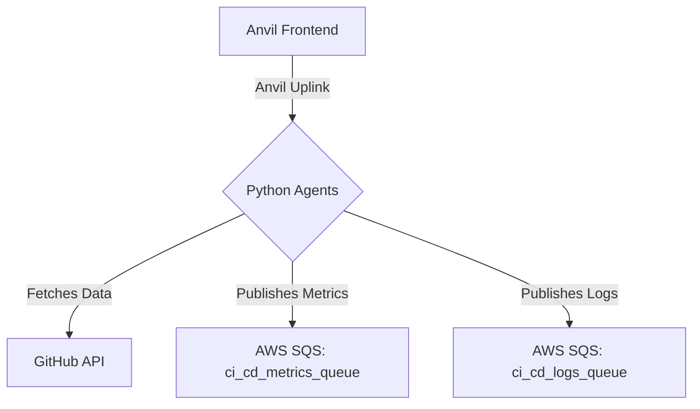

# AI-Driven CI/CD Data Collection and Monitoring Pipeline

This repository contains the backend agents and frontend monitoring UI for an AI-driven CI/CD optimization system. The primary goal of this layer is to collect detailed data from GitHub Actions and stream it into a message queue (AWS SQS) for further analysis and processing.

## Overview

The system is composed of two main parts:
1.  **Python Backend Agents**: Long-running processes responsible for fetching data from the GitHub API.
2.  **Anvil Frontend**: A web-based user interface for configuring the agents, triggering actions, and monitoring their status.

Communication between the frontend and backend is handled seamlessly via the **Anvil Uplink**.

## Architecture

The architecture is designed to be decoupled and scalable:

1.  **Anvil UI (Frontend)**: The user interacts with this web app to provide a GitHub repository URL and trigger data collection.
2.  **Anvil Uplink**: A secure websocket bridge that connects the web app to the backend Python agents.
3.  **Pipeline Monitoring Agent (Backend)**:
    - Connects to the GitHub API using a Personal Access Token (PAT).
    - Fetches detailed data about workflow runs, jobs, steps, and associated commits.
    - Publishes this data as JSON messages to an AWS SQS queue (`ci_cd_metrics_queue`).
4.  **Log Ingestion Agent (Backend - *In Progress*)**:
    - Fetches raw text logs for each completed job.
    - Publishes these logs to a separate AWS SQS queue (`ci_cd_logs_queue`).
5.  **AWS SQS (Message Queue)**: Acts as a buffer and entry point for the next layer of the AI pipeline, ensuring that data is never lost.



## Features

- **Real-time Monitoring**: A simple Anvil web UI to monitor the status of the data collection agents.
- **Dynamic Configuration**: Configure the target GitHub repository directly from the UI without restarting the agents.
- **Manual Data Trigger**: Manually trigger a data collection cycle on demand.
- **Robust Data Collection**: Gathers comprehensive data including:
    - Workflow run status, conclusion, and duration.
    - Job details, timings, and steps.
    - Associated commit metrics (files changed, additions, deletions).
- **Decoupled Messaging**: Uses AWS SQS to decouple the data collection from data processing, improving resilience.

## Getting Started

Follow these instructions to get the project running on your local machine.

### Prerequisites

- Python 3.10+
- An Anvil account (the free plan is sufficient).
- A GitHub account and a [Personal Access Token (PAT)](https://docs.github.com/en/authentication/keeping-your-account-and-data-secure/managing-your-personal-access-tokens) with `repo` scope.
- An AWS account with an IAM user that has programmatic access (`AWS_ACCESS_KEY_ID`, `AWS_SECRET_ACCESS_KEY`).
- Two AWS SQS standard queues created (e.g., `ci_cd_metrics_queue` and `ci_cd_logs_queue`).

### Installation

1.  **Clone the repository:**
    ```bash
    git clone https://github.com/talatops/AI-DRIVEN-CICD-PIPELINE.git
    cd AI-DRIVEN-CICD-PIPELINE
    ```

2.  **Create a virtual environment and activate it:**
    ```bash
    # For Windows
    python -m venv venv
    .\venv\Scripts\activate

    # For macOS/Linux
    python3 -m venv venv
    source venv/bin/activate
    ```

3.  **Install the required dependencies:**
    ```bash
    pip install -r requirements.txt
    ```

### Configuration

1.  **Create a `.env` file** in the root of the project by copying the example:
    ```bash
    # For Windows
    copy .env.example .env

    # For macOS/Linux
    cp .env.example .env
    ```

2.  **Edit the `.env` file** and fill in your credentials:
    ```env
    # Your GitHub PAT with 'repo' scope
    GITHUB_PAT=ghp_xxxxxxxx

    # Your Anvil Server Uplink Key (found in your Anvil app's settings)
    ANVIL_UPLINK_KEY=your_anvil_server_key

    # Your AWS IAM credentials
    AWS_ACCESS_KEY_ID=your_aws_access_key
    AWS_SECRET_ACCESS_KEY=your_aws_secret_key
    AWS_REGION=us-east-1 # Or your preferred region

    # The names of your SQS queues
    METRICS_QUEUE_NAME=ci_cd_metrics_queue
    LOGS_QUEUE_NAME=ci_cd_logs_queue
    ```

## Usage

1.  **Start the backend agents:**
    Run the `main.py` script from the root directory. This will start the agents and connect them to the Anvil service.
    ```bash
    python main.py
    ```
    You should see log messages in your terminal confirming that the agents are running and connected.

2.  **Launch the Anvil Frontend:**
    - Go to your Anvil editor.
    - Open the application you created for this project.
    - Click the "Run" button to launch the web UI.

3.  **Operate the System:**
    - In the Anvil app, enter the URL of a GitHub repository you want to monitor.
    - Click **"Set Repository"**.
    - Click **"Trigger Manual Data Collection"** to fetch the latest workflow data.
    - Check your terminal to see the agent's activity and your AWS SQS console to see the incoming messages.

## Project Structure

```
.  
├── anvil_app/                  # Anvil application code
│   ├── server_code/
│   │   ├── pipeline_monitor.py   # Agent for collecting workflow metrics
│   │   └── log_ingester.py       # Agent for collecting raw logs (WIP)
│   └── ...                     # Other Anvil assets
├── requirements/               # Project requirements documents
│   └── layer-1.md
├── .env                        # Local environment variables (ignored by git)
├── .env.example                # Example environment file
├── .gitignore
├── main.py                     # Main script to start the backend agents
├── README.md                   # This file
└── requirements.txt            # Python dependencies
```

## Next Steps

- [ ] Complete the implementation of the **Log Ingestion Agent**.
- [ ] Add a background polling mechanism for continuous, automated data collection.
- [ ] Enhance the Anvil frontend to display collected metrics and logs.
- [ ] Add comprehensive error handling and retry logic.
